---
title: "The Ultimate Markdown Conversion Test"
subtitle: "A self-documenting torture test for Markdown → HTML / PDF / DOCX / LaTeX converters"
author: "Markdown Conversion QA"
date: 2026-09-12
lang: en-US
keywords: [markdown, commonmark, gfm, mermaid, katex, pandoc, conversion, testing]
toc: true
toc-depth: 3
numbersections: false
geometry: margin=1in
documentclass: article
fontsize: 11pt
abstract: |
  This document is BOTH the test fixture and its own documentation. Every
  section states (a) what feature is under test, (b) which flavors support it,
  and (c) exactly what correct output looks like, so you can diff expectation
  against reality without a separate answer key.
---

# <!--

# HOW TO USE THIS FILE

 1. Render it with your converter (pandoc, marked, markdown-it, remark,
    Typora, Obsidian, VS Code preview, GitHub, GitLab, Quarto, mdBook...).
 2. Walk the document top to bottom. Each section has a "PASS IF" note.
 3. Score yourself with the scorecard in Appendix A at the bottom.
 4. Known-hostile constructs are flagged with the words HAZARD or EDGE CASE.

# This HTML comment itself is test #0: it MUST NOT appear in rendered output.

-->

# The Ultimate Markdown Conversion Test

> **Test #0 — YAML front matter.** The block fenced by `---` at the very top of
> this file is YAML metadata. **PASS IF** it is either consumed as document
> metadata (title/author/date applied to the output) or hidden entirely.
> **FAIL IF** you see raw `title: "The Ultimate..."` text, or a horizontal rule
> followed by a `title:` paragraph, or an `<h2>` reading `title: ...`.

This file exercises **CommonMark**, **GitHub Flavored Markdown (GFM)**,
**Pandoc Markdown**, **MultiMarkdown**, **Obsidian/Quarto extensions**,
**Mermaid** (20+ diagram types, with `classDef` color styling), and
**LaTeX math** (inline + display + AMS environments).

It is deliberately *self-explaining*: the prose around every construct tells you
what the construct is supposed to do. If your converter mangles something, the
surviving prose will still tell you what you were looking at.

---

## Table of Contents

> **Test #1 — Auto-generated anchors.** Every heading below should get a URL
> slug. GitHub lowercases, strips punctuation, and replaces spaces with hyphens.
> **PASS IF** these links jump to their sections. **FAIL IF** they 404 or
> render as literal text.

1. [Headings](#headings)
2. [Paragraphs, Line Breaks & Whitespace](#paragraphs-line-breaks--whitespace)
3. [Inline Emphasis & Text Decoration](#inline-emphasis--text-decoration)
4. [Escaping, Entities & Unicode](#escaping-entities--unicode)
5. [Blockquotes & Admonitions](#blockquotes--admonitions)
6. [Lists of Every Shape](#lists-of-every-shape)
7. [Code: Inline, Fenced, Indented, Nested](#code-inline-fenced-indented-nested)
8. [Links, Images & Footnotes](#links-images--footnotes)
9. [Tables](#tables)
10. [Horizontal Rules](#horizontal-rules)
11. [Raw HTML](#raw-html)
12. [Definition Lists, Abbreviations & Metadata Blocks](#definition-lists-abbreviations--metadata-blocks)
13. [Mathematics](#mathematics)
14. [Mermaid Diagrams](#mermaid-diagrams)
15. [Deeply Nested & Adversarial Combinations](#deeply-nested--adversarial-combinations)
16. [Appendix A — Scorecard](#appendix-a--conversion-scorecard)

---

## Headings

> **What is under test.** Six ATX levels, the two Setext levels, headings with
> inline markup, headings with trailing hashes, and headings with awkward
> characters. **PASS IF** each renders at the correct semantic level (`<h1>`…
> `<h6>`) and the inline markup inside them survives.

# H1 — Level One Heading (ATX)

## H2 — Level Two Heading

### H3 — Level Three Heading

#### H4 — Level Four Heading

##### H5 — Level Five Heading

###### H6 — Level Six Heading

# Setext H1 — Underlined With Equals Signs

## Setext H2 — Underlined With Hyphens

### H3 containing `inline code`, **bold**, *italic*, [a link](https://example.com) and a symbol: →

### Closed ATX heading with trailing hashes ###

### Heading with "quotes", an em—dash, 100% & ampersand, and C++/C\#

> **EDGE CASE.** The next line has seven `#` characters. Seven is *not* a valid
> heading in CommonMark and must render as a literal paragraph.

####### Seven hashes is not a heading — this should be plain text

> **PASS IF** the line above is a paragraph beginning with seven `#` characters.
> **FAIL IF** it became an `<h6>`.

---

## Paragraphs, Line Breaks & Whitespace

> **What is under test.** Paragraph separation, soft wraps, two-space hard
> breaks, backslash hard breaks, and `<br>` hard breaks.

This is a single paragraph.
This second line is separated only by a newline, so it is a **soft break** and
should join the previous line into one flowing paragraph when rendered.

This line ends with two spaces  
so the line above should become a **hard break** — a `<br>` within the same
paragraph, not a new paragraph.

This line ends with a backslash\
and Pandoc/CommonMark treat that as a **hard break** too.

This line uses an explicit HTML break tag.<br>And continues after it.

A paragraph separated from the next by a **completely blank line** — the most
boring and most important test in the file.

&nbsp;&nbsp;&nbsp;&nbsp;This paragraph begins with four non-breaking spaces
(`&nbsp;`), which must **not** turn it into a code block.

> **HAZARD.** Trailing-whitespace hard breaks are invisible in source and are
> the single most commonly lost feature in DOCX and LaTeX export. Check them.

---

## Inline Emphasis & Text Decoration

> **What is under test.** The full inline formatting matrix, including the
> combinations that trip naive regex-based converters.

| Construct                   | Source               | Expected rendering                                  |
| --------------------------- | -------------------- | --------------------------------------------------- |
| Italic (asterisk)           | `*italic*`           | *italic*                                            |
| Italic (underscore)         | `_italic_`           | *italic*                                            |
| Bold (asterisk)             | `**bold**`           | **bold**                                            |
| Bold (underscore)           | `__bold__`           | **bold**                                            |
| Bold + italic               | `***both***`         | ***both***                                          |
| Bold + italic mixed         | `**_both_**`         | ***both***                                          |
| Strikethrough (GFM)         | `~~struck~~`         | ~~struck~~                                          |
| Inline code                 | `` `code` ``         | `code`                                              |
| Highlight (Obsidian/Quarto) | `==mark==`           | ==highlighted==                                     |
| Subscript (Pandoc)          | `H~2~O`              | H~2~O                                               |
| Superscript (Pandoc)        | `E=mc^2^`            | E=mc^2^                                             |
| Small caps (Pandoc)         | `[text]{.smallcaps}` | [small caps]{.smallcaps}                            |
| Underline (HTML)            | `<u>u</u>`           | <u>underlined</u>                                   |
| Keyboard (HTML)             | `<kbd>Ctrl</kbd>`    | <kbd>Ctrl</kbd>+<kbd>C</kbd>                        |
| Insert / delete (HTML)      | `<ins>` / `<del>`    | <ins>inserted</ins> <del>deleted</del>              |
| Abbreviation (HTML)         | `<abbr>`             | <abbr title="HyperText Markup Language">HTML</abbr> |

### Nesting and adjacency torture

- Bold containing italic: **outer bold with *inner italic* inside**
- Italic containing bold: *outer italic with **inner bold** inside*
- Code inside bold: **bold with `code()` inside**
- Bold inside a link: [**bold link text**](https://example.com)
- Link inside bold: **text with [a link](https://example.com) inside**
- Strikethrough + bold: ~~**struck and bold**~~
- Emphasis touching punctuation: *"quoted italic"*, **(parenthesized bold)**, *italic*—dash
- Intra-word underscores must NOT emphasize: snake_case_variable_name stays intact
- Intra-word asterisks in GFM DO emphasize: un*frigging*believable
- Literal asterisks: 2 \* 3 \* 4 = 24
- Emphasis spanning a soft line break: *this italic phrase
  continues onto the next source line*

> **PASS IF** `snake_case_variable_name` renders with all underscores visible.
> This is the classic CommonMark-vs-legacy-Markdown divergence.

---

## Escaping, Entities & Unicode

> **What is under test.** Backslash escapes, HTML entities, and non-ASCII text
> including CJK, RTL, combining marks, and emoji with zero-width joiners.

### Backslash escapes — all of these should render as literal characters

\\ backslash, \` backtick, \* asterisk, \_ underscore, \{ \} braces,
\[ \] brackets, \( \) parens, \# hash, \+ plus, \- hyphen, \. dot, \! bang,
\| pipe, \< \> angle brackets, \~ tilde

### HTML entities

&amp; (amp) &lt; (lt) &gt; (gt) &quot; (quot) &copy; (copy) &reg; (reg)
&trade; (trade) &hellip; (hellip) &mdash; (mdash) &ndash; (ndash) &deg; (deg)
&plusmn; (plusmn) &times; (times) &divide; (divide) &frac12; (half)
&alpha; &beta; &gamma; &pi; &Omega; &rarr; &larr; &harr; &infin; &ne; &le; &ge;
&#8364; (numeric euro) &#x1F600; (hex emoji)

### Smart punctuation (Pandoc `--smart` / typographer plugins)

"Double quotes" become curly, 'single quotes' too, an ellipsis... becomes one
glyph, an em---dash and an en--dash collapse. **PASS IF** enabled; harmless if
left as straight ASCII.

### Unicode stress

| Script / class        | Sample                                           |
| --------------------- | ------------------------------------------------ |
| Latin + diacritics    | àéîõü ÿ ñ ç ø å æ œ ß                            |
| Combining marks       | é (precomposed) vs e&#769; (e + combining acute) |
| Greek                 | Α Β Γ Δ Ε Ζ Η Θ Ι Κ Λ Μ Ν Ξ Ο Π Ρ Σ Τ Υ Φ Χ Ψ Ω  |
| Cyrillic              | Привет, мир! Ёжик в тумане                       |
| Chinese               | 你好，世界。这是一个测试。                                    |
| Japanese              | こんにちは世界。日本語のテキスト、カタカナ、漢字。                        |
| Korean                | 안녕하세요 세계. 한글 텍스트입니다.                             |
| Arabic (RTL)          | مرحبا بالعالم — هذا نص تجريبي                    |
| Hebrew (RTL)          | שלום עולם — זהו טקסט לבדיקה                      |
| Devanagari            | नमस्ते दुनिया                                    |
| Thai (no word spaces) | สวัสดีชาวโลก นี่คือการทดสอบ                      |
| Math symbols          | ∀x∈ℝ ∃y ∮ ∇ ⊕ ⊗ ≅ ≈ ∴ ∵ ℵ                        |
| Box drawing           | ┌───┬───┐ │ a │ b │ └───┴───┘                    |
| Emoji (simple)        | 😀 🎉 🚀 ✅ ❌ ⚠️ 📊 🧪                            |
| Emoji (ZWJ sequences) | 👩‍💻 👨‍👩‍👧‍👦 🏳️‍🌈 🧑🏽‍🚀                 |
| Emoji (skin tone)     | 👍🏻 👍🏽 👍🏿                                   |
| GFM short codes       | :smile: :rocket: :warning: :white_check_mark:    |

> **HAZARD.** Emoji ZWJ sequences (👩‍💻 is *woman* + ZWJ + *laptop*) frequently
> split into two separate glyphs in PDF/DOCX output. GFM `:shortcodes:` are only
> converted by GitHub-flavored renderers; staying literal elsewhere is fine.

---

## Blockquotes & Admonitions

> **What is under test.** Simple quotes, multi-paragraph quotes, nested quotes,
> quotes containing every other block type, lazy continuation, and the two
> competing admonition/callout syntaxes.

> A simple single-line blockquote.

> A blockquote with two paragraphs.
>
> This is the second paragraph inside the same blockquote.

> Level 1 quote.
>
> > Level 2 nested quote.
> >
> > > Level 3 nested quote — how deep does your renderer indent?

> ### A heading inside a blockquote
>
> - A list item inside a blockquote
> - Another item
>
> ```python
> def inside_a_quote():
>     return "fenced code inside a blockquote"
> ```
>
> | Table | Inside | Quote |
> |---|---|---|
> | a | b | c |
>
> Final paragraph of the quote, with **bold**, *italic*, and `code`.

> This blockquote uses **lazy continuation**: the marker appears on the first
line only, and the following lines have no `>` at all.
They should still be absorbed into the same blockquote.

> — *Attribution line, em-dash style*

### GitHub-style alerts (GFM callouts)

> [!NOTE]
> Useful information that users should know, even when skimming content.

> [!TIP]
> Helpful advice for doing things better or more easily.

> [!IMPORTANT]
> Key information users need to know to achieve their goal.

> [!WARNING]
> Urgent info that needs immediate user attention to avoid problems.

> [!CAUTION]
> Advises about risks or negative outcomes of certain actions.

### Pandoc/Quarto-style fenced callouts

::: {.callout-note title="Fenced div callout"}
This is a **Pandoc fenced div** with a class. Quarto renders it as a styled
callout box; plain CommonMark renderers will show the `:::` markers literally,
which is an acceptable (if ugly) degradation.
:::

::: warning
A bare fenced div with the class `warning`. MkDocs/Material and Quarto style
this; GitHub does not.
:::

!!! note "MkDocs admonition syntax"
    This indented block uses the Python-Markdown `!!!` admonition extension.
    Only MkDocs and Python-Markdown understand it.

> **PASS IF** at least the *text* of every callout survives in readable form,
> even when the decorative box is not supported.

---

## Lists of Every Shape

> **What is under test.** Bullet markers, ordered markers, start offsets,
> nesting depth, tight vs. loose spacing, task lists, lists interrupted by other
> blocks, and lazy continuation.

### Unordered, three marker styles (each is a separate list)

- Hyphen marker, item one
- Hyphen marker, item two

* Asterisk marker, item one
* Asterisk marker, item two

+ Plus marker, item one
+ Plus marker, item two

### Ordered lists

1. First item
2. Second item
3. Third item

<!-- separator so the next list is not merged with the previous one -->

1. All-ones numbering, first
2. All-ones numbering, second
3. All-ones numbering, third — renderers should output 1, 2, 3

5. A list that **starts at five**
6. Six
7. Seven

8) Parenthesis-style ordered marker
9) Second item

### Nesting to five levels, mixing ordered and unordered

1. Level 1 — ordered
   - Level 2 — unordered
     1. Level 3 — ordered
        - Level 4 — unordered
          1. Level 5 — ordered, the deepest point
          2. Level 5, sibling
        - Level 4, sibling
     2. Level 3, sibling
   - Level 2, sibling
2. Level 1, sibling

### Tight vs. loose lists

Tight list (no blank lines — items should render without `<p>` wrappers and with
minimal vertical spacing):

- Tight one
- Tight two
- Tight three

Loose list (blank lines between items — items get `<p>` wrappers and extra
spacing):

- Loose one

- Loose two

- Loose three

### Multi-block list items

1. A list item whose first paragraph is here.

   A **second paragraph** belonging to the same list item, indented by three
   spaces to stay inside it.

   ```bash
   # A fenced code block inside a list item
   echo "indentation is the whole test here"
   ```

   > A blockquote inside a list item.

   | Col A | Col B              |
   | ----- | ------------------ |
   | table | inside a list item |

   - A nested sub-list closing out the item.

2. The second top-level item, proving the list survived all of that.

### Task lists (GFM)

- [x] Completed task
- [ ] Incomplete task
- [X] Completed with capital X
- [ ] Task with **bold**, `code`, and a [link](https://example.com)
- [ ] Parent task
  - [x] Nested completed subtask
  - [ ] Nested incomplete subtask
    - [ ] Third-level subtask

> **PASS IF** checkboxes render as real (disabled) checkbox widgets in HTML, or
> as `☒` / `☐` glyphs in PDF/DOCX. **FAIL IF** you see literal `[x]` text.

### Lazy continuation and hanging indents

- This list item's text is wrapped across
lines with no indentation at all, which is
"lazy continuation" and must still belong to the item.

- This item uses a proper hanging indent
  aligned under the text, which is the safer style.

### Lists containing hard-to-parse text

- An item containing a literal number followed by a period: 1986. It was a year.
- An item whose text starts with a marker-like string: \- not a nested bullet
- An item containing a pipe | character, relevant for table parsers
- An item ending with a colon:
- An item containing an unclosed bracket [ and brace {

---

## Code: Inline, Fenced, Indented, Nested

> **What is under test.** Inline code with awkward contents, fenced blocks with
> and without language hints, tilde fences, indented blocks, nested fences, and
> line-highlight / filename attributes.

### Inline code

Basic `inline code`. Code containing a backtick: `` a ` b ``. Code containing
double backticks: ``` a `` b ```. Code with markdown inside that must NOT be
interpreted: `**not bold** and _not italic_ and [not a link](x)`. Code with
HTML: `<div class="x">`. Code with entities: `&amp; &lt; &gt;`. Code with a
newline-ish run of spaces: `a     b`. Empty-ish code: ` `.

### Fenced code with language hints (syntax-highlighting check)

```python
# Python — check keyword, string, comment, decorator and f-string colouring
from dataclasses import dataclass

@dataclass(frozen=True)
class Particle:
    name: str
    charge: float = 0.0

    def describe(self) -> str:
        sign = "+" if self.charge > 0 else "-" if self.charge < 0 else "0"
        return f"{self.name}: charge {self.charge:+.3f} ({sign})"

if __name__ == "__main__":
    print(Particle("electron", -1.0).describe())
```

```javascript
// JavaScript — template literals, async/await, regex, destructuring
const RE = /^\s*(?<key>[\w.-]+)\s*=\s*(?<value>.*)$/u;

export async function loadConfig(url, { timeout = 5_000 } = {}) {
  const ctrl = new AbortController();
  const timer = setTimeout(() => ctrl.abort(), timeout);
  try {
    const res = await fetch(url, { signal: ctrl.signal });
    if (!res.ok) throw new Error(`HTTP ${res.status}`);
    return Object.fromEntries(
      (await res.text())
        .split("\n")
        .map((l) => l.match(RE)?.groups)
        .filter(Boolean)
        .map(({ key, value }) => [key, value])
    );
  } finally {
    clearTimeout(timer);
  }
}
```

```sql
-- SQL — CTEs, window functions, comments
WITH ranked AS (
    SELECT
        student_id,
        course_id,
        score,
        ROW_NUMBER() OVER (PARTITION BY course_id ORDER BY score DESC) AS rnk
    FROM enrollment.grades
    WHERE score IS NOT NULL AND term = '2026-FA'
)
SELECT course_id, student_id, score
FROM ranked
WHERE rnk <= 3
ORDER BY course_id, rnk;
```

```powershell
# PowerShell — the shell this file was generated from
$ErrorActionPreference = 'Stop'
Get-ChildItem -Path 'C:\Users\pcarver\Downloads' -Filter '*.md' |
    Where-Object { $_.Length -gt 1kb } |
    Select-Object Name, @{ n = 'KB'; e = { [math]::Round($_.Length / 1kb, 1) } } |
    Format-Table -AutoSize
```

```yaml
# YAML — anchors, aliases, multi-line scalars, comments
defaults: &defaults
  retries: 3
  timeout: 30s
services:
  api:
    <<: *defaults
    image: registry.example.com/api:1.4.2
    command: >
      folded scalar that becomes
      one long line
    notes: |
      literal scalar
      that keeps its newlines
```

```json
{
  "name": "markdown-conversion-test",
  "version": "1.0.0",
  "unicode": "naïve café — 日本語 — 🚀",
  "escaped": "a \"quoted\" string with a \\ backslash and a \u00e9",
  "nested": { "array": [1, 2.5, -3e10, true, false, null] }
}
```

```diff
--- a/config.yaml
+++ b/config.yaml
@@ -1,6 +1,7 @@
 service:
   name: converter
-  timeout: 30
+  timeout: 60
+  retries: 3
   verbose: false
```

```
A fenced block with NO language hint at all.
Indentation   must   be   preserved   exactly.
	This line begins with a literal TAB character.
Special characters must not be interpreted: **bold** _italic_ <b>html</b> | pipe
```

~~~text
A block fenced with TILDES instead of backticks.
This is valid CommonMark and is the easiest way to embed ``` inside a block.
```
```

    This is an INDENTED code block (four spaces, no fence).
    It is the oldest form of Markdown code block.
    *Markdown inside must not be interpreted.*

### Nested fences (the classic renderer-killer)

Below, a four-backtick fence wraps a three-backtick fence so that the inner
fence is shown as literal text rather than being executed:

````markdown
```python
print("this inner block is CONTENT, not a real code block")
```
````

> **HAZARD.** Converters that count fences naively will terminate the outer
> block at the inner closing fence and spill the rest of this section into a
> code block. **PASS IF** the four-backtick block above displays three-backtick
> markers literally.

### Fence info-string extensions

```python title="example.py" linenums="1" hl_lines="2 3"
def f(x):
    y = x * 2       # highlighted in MkDocs-Material
    return y + 1    # highlighted in MkDocs-Material
```

```{.bash #snippet-id .numberLines startFrom="10"}
# Pandoc-style attribute info string
echo "attributes may be ignored, but must not leak into the output"
```

---

## Links, Images & Footnotes

> **What is under test.** Every link syntax, image syntax, reference
> definitions, footnotes, and the URL shapes that break naive parsers.

### Link forms

- Inline link: [Example Domain](https://example.com)
- Inline link with title: [Example](https://example.com "The title attribute")
- Reference link: [reference style][ref-1]
- Collapsed reference: [ref-2][]
- Shortcut reference: [ref-3]
- Bare autolink: <https://example.com/autolink>
- Email autolink: <someone@example.com>
- Raw URL (GFM linkifies): https://example.com/raw-url-no-brackets
- Relative link: [another file](./sibling-document.md)
- Anchor link within this file: [jump to Mathematics](#mathematics)
- Link with parentheses in the URL: [Wikipedia (disambiguation)](https://en.wikipedia.org/wiki/Test_(assessment))
- Link with encoded spaces: [encoded](https://example.com/a%20path%20with%20spaces)
- Link with query and fragment: [query](https://example.com/search?q=markdown&lang=en#results)
- Link with angle-bracketed URL containing spaces: [spaces](<https://example.com/a b c>)
- Link whose text contains brackets: [text \[with\] brackets](https://example.com)
- Empty link text: [](https://example.com/empty-text)
- Link to a `code` span: [`monospace link text`](https://example.com)
- Wiki-link (Obsidian): [[Some Other Note]] and [[Some Other Note|aliased text]]
- Footnote-style link that is intentionally **undefined**: [broken][no-such-ref]

[ref-1]: https://example.com/reference-one "Reference One"
[ref-2]: https://example.com/reference-two
[ref-3]: https://example.com/reference-three 'Single-quoted title'

### Images

Inline image with alt text and title:


Reference-style image:

![Reference image alt text][img-ref]

[img-ref]: https://via.placeholder.com/320x120.png "Remote placeholder image"

Inline SVG as a data URI (vector, should scale cleanly):


Linked image (image wrapped in a link):

[](https://example.com)

Image with a Pandoc/Quarto size attribute:

{width=64px height=64px}

A **deliberately broken image** (the alt text must be shown as a fallback):


Figure with caption (Pandoc turns a lone image paragraph into a `<figure>`):


### Footnotes

Markdown footnotes come in several dialects. Here is a simple one[^simple], one
with a longer multi-paragraph body[^long], an inline footnote^[This is a Pandoc
*inline* footnote, defined right where it is used.], and a numeric-style
reference[^1].

[^simple]: A short, single-line footnote definition.

[^long]: A footnote with **formatting**, a `code span`, and a
    [link](https://example.com).

    It also has a second paragraph, indented four spaces to stay attached to
    the footnote.

    ```text
    ...and even a code block inside the footnote.
    ```

[^1]: A footnote whose identifier is the number 1. Renderers should renumber
    footnotes in order of appearance regardless of the label used.

> **PASS IF** footnote markers become superscript links and the definitions are
> collected at the end of the document (or the page, in paged output).

---

## Tables

> **What is under test.** GFM pipe tables, alignment rows, ragged rows, inline
> markup inside cells, escaped pipes, empty cells, and the non-GFM table
> dialects that Pandoc supports.

### Basic GFM table

| Feature      | Supported | Notes             |
| ------------ | --------- | ----------------- |
| Pipe tables  | Yes       | The GFM standard  |
| Alignment    | Yes       | See below         |
| Row spanning | No        | Requires raw HTML |

### Column alignment

| Left aligned     |  Center aligned  |    Right aligned | Default          |
| :--------------- | :--------------: | ---------------: | ---------------- |
| left             |      center      |            right | default          |
| a                |        b         |                c | d                |
| 1                |        22        |              333 | 4444             |
| longer cell text | longer cell text | longer cell text | longer cell text |

### Formatting inside cells

| Element             | Example                                                           | Renders as                                                                                                                                          |
| ------------------- | ----------------------------------------------------------------- | --------------------------------------------------------------------------------------------------------------------------------------------------- |
| Bold                | `**bold**`                                                        | **bold**                                                                                                                                            |
| Italic              | `*italic*`                                                        | *italic*                                                                                                                                            |
| Code                | `` `code` ``                                                      | `code`                                                                                                                                              |
| Link                | `[x](url)`                                                        | [example](https://example.com)                                                                                                                      |
| Image               | ``                                                  |  |
| Strikethrough       | `~~x~~`                                                           | ~~struck~~                                                                                                                                          |
| Escaped pipe        | `a \| b`                                                          | a \| b                                                                                                                                              |
| Inline math         | `$x^2$`                                                           | $x^2$                                                                                                                                               |
| Line break          | `a<br>b`                                                          | a<br>b                                                                                                                                              |
| Emoji               | `🚀`                                                              | 🚀                                                                                                                                                  |
| Empty cell          |                                                                   |                                                                                                                                                     |
| Long unbroken token | `supercalifragilisticexpialidocious_antidisestablishmentarianism` | wraps or overflows?                                                                                                                                 |

### Ragged / malformed rows (EDGE CASE)

| A             | B     | C    |                         |
| ------------- | ----- | ---- | ----------------------- |
| only one cell |       |      |                         |
| two           | cells |      |                         |
| three         | cells | here |                         |
| four          | cells | here | extra-should-be-dropped |

> **PASS IF** the table still renders with three columns and missing cells come
> out empty. **FAIL IF** the table collapses into paragraphs of pipe characters.

### Unaligned source pipes (valid, just ugly)

| Feature            | Value       |
| ------------------ | ----------- |
| No padding at all  | works       |
| wildly             | uneven      |
| spacing everywhere | still valid |

### Table without leading/trailing pipes

Feature | Value
--------|------
Leading pipe omitted | valid GFM
Trailing pipe omitted | also valid

### Pandoc grid table (non-GFM)

+---------------+---------------+--------------------+

| Fruit         | Price         | Advantages         |

+ ===============+===============+====================+

| Bananas       | $1.34         | - built-in wrapper |
|               |               | - bright color    |

+---------------+---------------+--------------------+

| Oranges       | $2.10         | - cures scurvy     |
|               |               | - tasty            |

+---------------+---------------+--------------------+

: Table caption for the grid table, Pandoc style.

### HTML table with a merged cell (the only portable way to span)

<table>
  <caption>An HTML table with <code>colspan</code> and <code>rowspan</code></caption>
  <thead>
    <tr><th>Region</th><th>Q1</th><th>Q2</th></tr>
  </thead>
  <tbody>
    <tr><td rowspan="2">North</td><td>100</td><td>120</td></tr>
    <tr><td colspan="2" style="text-align:center">merged across two columns</td></tr>
    <tr><td>South</td><td>80</td><td>95</td></tr>
  </tbody>
  <tfoot>
    <tr><th>Total</th><td>180</td><td>215</td></tr>
  </tfoot>
</table>

---

## Horizontal Rules

> **What is under test.** All three rule markers, spaced variants, and the
> Setext ambiguity where `---` under text becomes a heading instead of a rule.

Three hyphens:

---

Three asterisks:

***

Three underscores:

___

Spaced markers (` - - - `):

- - -

Many markers:

**********

> **EDGE CASE.** The line below `A paragraph immediately followed by hyphens` is
> `-------`, which makes it a **Setext H2**, not a horizontal rule:

## A paragraph immediately followed by hyphens

---

## Raw HTML

> **What is under test.** Block-level HTML passthrough, inline HTML, self-closing
> tags, HTML with attributes and inline styles, and the security-sensitive tags
> that sanitizers strip.

### Block HTML with styling

<div style="border-left: 4px solid #6366f1; background: #eef2ff; color: #1e1b4b; padding: 0.75rem 1rem; border-radius: 6px;">
  <strong>A styled callout built from raw HTML.</strong>
  Converters that pass HTML through will show a colored box; converters that
  strip HTML should still show this sentence as plain text.
</div>

### Collapsible section (`<details>`)

<details>
  <summary><strong>Click to expand — this summary must remain visible</strong></summary>

  Content hidden behind the disclosure triangle. Note the blank line above,
  which allows **Markdown inside the HTML block** to still be parsed by most
  renderers.

  - A markdown list inside `<details>`
  - A second item

  ```python
  print("a fenced code block inside <details>")
  ```

</details>

### Inline HTML

Text with <span style="color:#e11d48; font-weight:600">red bold span</span>,
a <sup>superscript</sup> and a <sub>subscript</sub>, a <mark>marked span</mark>,
a <small>small span</small>, a <q>quoted span</q>, a <cite>citation</cite>,
a <var>variable</var>, <samp>sample output</samp>, and
<time datetime="2026-09-12">a machine-readable date</time>.

### Structures sanitizers usually strip

<script>console.log("This script MUST NOT execute or appear as text.");</script>

<style>.should-not-apply { color: hotpink; }</style>

<iframe src="https://example.com" width="200" height="80" title="iframe test"></iframe>

<form><input type="text" placeholder="form input" /><button>Submit</button></form>

<!-- An inline HTML comment: also must not render. -->

> **PASS IF** the script does not execute, the style does not apply, and none of
> the raw tag text leaks into the visible output. Stripping them entirely is the
> correct behavior for a sanitizing converter.

### Self-closing and void elements

A horizontal rule as HTML: <hr />

A line break: first<br />second

An image tag: <rect width='16' height='16' fill='%23f59e0b'/></svg>" alt="orange square" width="16" height="16" />

---

## Definition Lists, Abbreviations & Metadata Blocks

> **What is under test.** Pandoc/PHP-Markdown-Extra constructs that GFM does not
> support. Graceful degradation to readable text is an acceptable result.

### Definition lists (Pandoc)

Markdown
:   A lightweight markup language created by John Gruber in 2004.

CommonMark
:   A strongly specified, highly compatible implementation of Markdown.
:   A second definition for the same term.

Mermaid
:   A JavaScript-based diagramming tool that renders text definitions into
    diagrams.

    A second paragraph of the same definition, indented to stay attached.

### Abbreviations (PHP Markdown Extra)

The HTML spec is maintained by the W3C and the WHATWG, and CSS is too.

* [HTML]: HyperText Markup Language
* [W3C]: World Wide Web Consortium
* [WHATWG]: Web Hypertext Application Technology Working Group
* [CSS]: Cascading Style Sheets

### Fenced divs and bracketed spans (Pandoc attributes)

::: {#special-block .note data-role="sidebar"}
A fenced div carrying an id, a class, and a data attribute.
:::

A [bracketed span]{.highlight #span-id lang="en"} with attributes attached.

### Line blocks (Pandoc — preserves line structure)

| The quick brown fox
|     jumps over
|         the lazy dog,
| and every leading space
|     should be preserved.

### Custom heading identifier

#### A heading with an explicit id {#custom-heading-id}

Link to it: [jump to the custom id](#custom-heading-id).

---

## Mathematics

> **What is under test.** Inline and display math in both the `$…$` and
> `\(…\)` families, AMS environments, matrices, cases, alignment, chemistry,
> and the dollar-sign ambiguities that break naive math detection.
>
> **Renderer support:** GitHub (KaTeX-ish), GitLab (KaTeX), Pandoc (`--mathjax`,
> `--katex`, or native LaTeX/OMML), Quarto, Obsidian, Typora, Jupyter.
> **PASS IF** formulas render as typeset mathematics. **PARTIAL** if they stay
> as readable LaTeX source. **FAIL IF** the LaTeX is mangled by the Markdown
> parser (e.g. `_` eaten as italics, `\\` collapsed, `*` turned into emphasis).

### Inline math

The mass–energy equivalence is $E = mc^2$, the quadratic roots are
$x = \frac{-b \pm \sqrt{b^2 - 4ac}}{2a}$, Euler's identity is
$e^{i\pi} + 1 = 0$, and a subscripted/superscripted mix is
$a_{i,j}^{(k)} \le \sum_{n=1}^{\infty} \frac{1}{n^2} = \frac{\pi^2}{6}$.

Alternate inline delimiters (Pandoc/MathJax): \( \alpha^2 + \beta^2 = \gamma^2 \).

Inline math containing an underscore-heavy expression, which must not be parsed
as emphasis: $T_{\text{max}} = \max_i x_i \cdot w_{i,\text{norm}}$.

Inline math containing asterisks: $a * b * c \ne a^{*} b^{*}$.

Inline math inside **bold text**: **the bound $\lVert x \rVert_2 \le 1$ holds**.

Inline math inside a list:

- Convergence requires $\lim_{n \to \infty} \lvert a_{n+1} - a_n \rvert = 0$.
- The complexity is $O(n \log n)$ average, $O(n^2)$ worst case.

### Display math — `$$` delimiters

$$
\int_{-\infty}^{\infty} e^{-x^2}\,dx = \sqrt{\pi}
$$

$$
\nabla \times \mathbf{B} - \frac{1}{c}\frac{\partial \mathbf{E}}{\partial t}
  = \frac{4\pi}{c}\mathbf{J}
$$

### Display math — `\[ … \]` delimiters

\[
f(x) = \int_{0}^{x} \frac{\sin t}{t}\, dt
\]

### Aligned equations (AMS `align`)

$$
\begin{align}
(a + b)^2 &= a^2 + 2ab + b^2 \\
(a - b)^2 &= a^2 - 2ab + b^2 \\
(a + b)(a - b) &= a^2 - b^2
\end{align}
$$

Unnumbered variant with `align*`:

$$
\begin{align*}
\frac{d}{dx}\left[ \int_{a}^{x} f(t)\,dt \right] &= f(x) \\
\frac{d}{dx} e^{g(x)} &= g'(x)\, e^{g(x)}
\end{align*}
$$

### Matrices

$$
A = \begin{pmatrix}
a_{11} & a_{12} & a_{13} \\
a_{21} & a_{22} & a_{23} \\
a_{31} & a_{32} & a_{33}
\end{pmatrix}
\quad
B = \begin{bmatrix} 1 & 0 \\ 0 & 1 \end{bmatrix}
\quad
\det(C) = \begin{vmatrix} a & b \\ c & d \end{vmatrix} = ad - bc
$$

### Cases, stacked conditions

$$
\operatorname{sgn}(x) =
\begin{cases}
  - 1, & \text{if } x < 0 \\
  \;\;0, & \text{if } x = 0 \\
  \;\;1, & \text{if } x > 0
\end{cases}
$$

### Large operators, limits and fractions

$$
\lim_{n \to \infty} \left(1 + \frac{1}{n}\right)^{n} = e
\qquad
\prod_{k=1}^{n} k = n!
\qquad
\bigcup_{i \in I} A_i
\qquad
\oint_{\partial \Sigma} \mathbf{F} \cdot d\boldsymbol{\ell}
$$

$$
\cfrac{1}{1 + \cfrac{1}{1 + \cfrac{1}{1 + \cdots}}} = \frac{\sqrt{5} - 1}{2}
$$

### Statistics and machine-learning notation

$$
\hat{\theta}_{\text{MLE}}
  = \arg\max_{\theta \in \Theta} \; \sum_{i=1}^{N} \log p(x_i \mid \theta)
$$

$$
\mathcal{L}(y, \hat{y}) = -\frac{1}{N}\sum_{i=1}^{N}
  \Big[ y_i \log \hat{y}_i + (1 - y_i)\log(1 - \hat{y}_i) \Big]
  + \frac{\lambda}{2}\lVert w \rVert_2^2
$$

$$
\operatorname{softmax}(z)_j = \frac{e^{z_j}}{\sum_{k=1}^{K} e^{z_k}},
\qquad
\mathrm{KL}(P \parallel Q) = \sum_{x \in \mathcal{X}} P(x)\log\frac{P(x)}{Q(x)}
$$

### Text, spacing, color and sizing inside math

$$
\underbrace{a + b + \cdots + z}_{26 \text{ terms}}
\quad\text{and}\quad
\overbrace{x_1, \ldots, x_n}^{\text{the sample}}
$$

$$
\textcolor{red}{E} = \textcolor{blue}{m}\textcolor{green}{c}^{2}
\qquad
\colorbox{yellow}{\(\text{highlighted formula}\)}
$$

$$
\left\{ \left[ \left( \frac{a}{b} \right)^{c} \right]_{d} \right\}^{e}
\qquad
\Big| \Bigg\| \bigg\langle x, y \bigg\rangle \Bigg\| \Big|
$$

### Chemistry (`mhchem` extension)

$$
\ce{CO2 + C -> 2 CO}
$$

$$
\ce{SO4^2- + Ba^2+ -> BaSO4 v}
\qquad
\ce{H2O <=> H+ + OH-}
$$

> **Note.** `mhchem` requires the extension to be loaded. Absence of support is
> an expected partial failure, not a parser bug.

### Dollar-sign HAZARDS (the classic false-positive trap)

The following paragraph contains **no math at all** and must render with plain
dollar signs:

> The widget costs $5.00 and the gadget costs $12.50, so the bundle is $17.50.
> In 2025 the team spent $1,200 on licenses and $450 on hosting.

Escaped dollars, which must show as literal `$`: \$100 and \$200.

A code span protecting dollars: `awk '{print $1, $3}'` and `echo $HOME`.

A fenced block protecting dollars:

```bash
PRICE=$5
echo "Total: $PRICE.00 — and $ALSO_NOT_MATH"
```

> **PASS IF** none of the amounts above are swallowed into a math expression.
> A converter that turns "costs $5.00 and the gadget costs $" into typeset math
> has a greedy `$…$` matcher and will corrupt real documents.

### LaTeX passthrough blocks (Pandoc raw blocks)

```{=latex}
\begin{center}
\fbox{This raw LaTeX block should appear only in LaTeX/PDF output.}
\end{center}
```

```{=html}
<p style="border:1px dashed #94a3b8;padding:6px">This raw HTML block should
appear only in HTML output.</p>
```

---

## Mermaid Diagrams

> **What is under test.** Mermaid is embedded as a fenced code block with the
> info string `mermaid`. Renderers fall into three groups:
>
> | Behavior | Verdict | Who does this |
> |---|---|---|
> | Renders an SVG diagram | **PASS** | GitHub, GitLab, Obsidian, Typora, Quarto, mdBook, VS Code preview |
> | Shows the source as a code block | **PARTIAL** (acceptable) | Plain Pandoc, most static generators without a plugin |
> | Shows the source as *unformatted prose* | **FAIL** | Broken fence handling |
>
> Color is applied with `classDef` (reusable named styles), `class` /
> `:::name` (applying them), `style` (one-off), `linkStyle` (edge color) and
> `%%{init: ...}%%` (theme variables). Every diagram below is deliberately
> styled so that a monochrome result tells you color support is missing.

### Flowchart — every node shape, every edge type, subgraphs, `classDef`

```mermaid
%%{init: {"theme": "base", "themeVariables": {"fontFamily": "Segoe UI, sans-serif", "fontSize": "14px"}, "flowchart": {"curve": "basis", "htmlLabels": true}}}%%
flowchart TD
    %% ---- node shapes ----
    A[Rectangle: default process]
    B(Rounded rectangle)
    C([Stadium / pill shape])
    D[[Subroutine]]
    E[(Database / cylinder)]
    F((Circle))
    G>Asymmetric flag]
    H{Rhombus: decision}
    I{{Hexagon: preparation}}
    J[/Parallelogram: input/]
    K[\Parallelogram alt: output\]
    L[/Trapezoid: manual op\]
    M[\Trapezoid alt/]
    N(((Double circle)))

    %% ---- edge types ----
    A --> B
    B --- C
    C -.-> D
    D ==> E
    E -->|labelled arrow| F
    F -.dotted label.-> G
    G ==thick label==> H
    H <--> I
    I o--o J
    J x--x K
    K ~~~ L
    L --> M --> N

    %% ---- subgraphs with their own direction ----
    subgraph INGEST ["1 · Ingest"]
        direction LR
        S1[/Upload/] --> S2{{Validate}} --> S3[(Staging DB)]
    end

    subgraph TRANSFORM ["2 · Transform"]
        direction TB
        T1[Parse Markdown] --> T2{Valid AST?}
        T2 -- yes --> T3[Emit HTML]
        T2 -- no --> T4[/Error report/]
    end

    subgraph DELIVER ["3 · Deliver"]
        direction LR
        D1[PDF] & D2[DOCX] & D3[LaTeX] --> D4((Archive))
    end

    N --> INGEST
    S3 --> TRANSFORM
    T3 --> DELIVER

    %% ---- reusable color classes ----
    classDef start      fill:#dbeafe,stroke:#1d4ed8,stroke-width:2px,color:#1e3a8a,font-weight:bold
    classDef process    fill:#f1f5f9,stroke:#475569,stroke-width:1.5px,color:#0f172a
    classDef decision   fill:#fef3c7,stroke:#d97706,stroke-width:2px,color:#78350f
    classDef datastore  fill:#dcfce7,stroke:#15803d,stroke-width:2px,color:#14532d
    classDef danger     fill:#fee2e2,stroke:#b91c1c,stroke-width:2px,color:#7f1d1d,stroke-dasharray:5 3
    classDef terminal   fill:#ede9fe,stroke:#6d28d9,stroke-width:3px,color:#4c1d95

    class A,B,C,D,L,M,T1,T3 process
    class H,I,T2,S2 decision
    class E,S3 datastore
    class T4 danger
    class F,N,D4 terminal
    class G,J,K,S1 start

    %% ---- inline class application with the ::: operator ----
    Z[Node styled inline with the ::: operator]:::danger
    N --> Z

    %% ---- one-off style and edge colouring ----
    style INGEST fill:#f8fafc,stroke:#94a3b8,stroke-dasharray:4 4
    style TRANSFORM fill:#f8fafc,stroke:#94a3b8,stroke-dasharray:4 4
    style DELIVER fill:#f8fafc,stroke:#94a3b8,stroke-dasharray:4 4
    linkStyle 4 stroke:#dc2626,stroke-width:3px
    linkStyle 6 stroke:#059669,stroke-width:3px
```

> **PASS IF** you see a colored flowchart: blue terminals, amber diamonds,
> green cylinders, a red dashed error node, and three dashed subgraph frames.

### Flowchart — left-to-right, emoji labels, markdown strings, escaped text

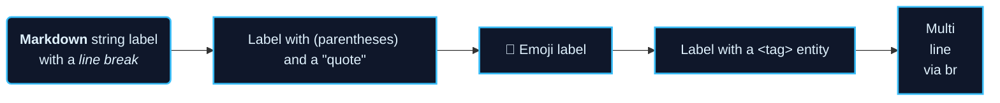

### Sequence diagram — the full feature set

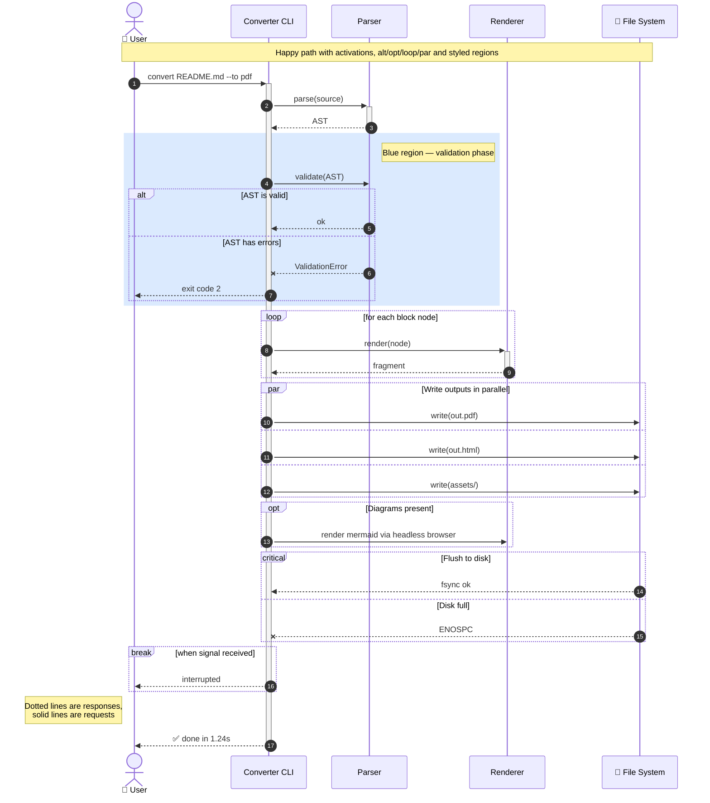

### Class diagram — generics, visibility, relationships, `cssClass` color

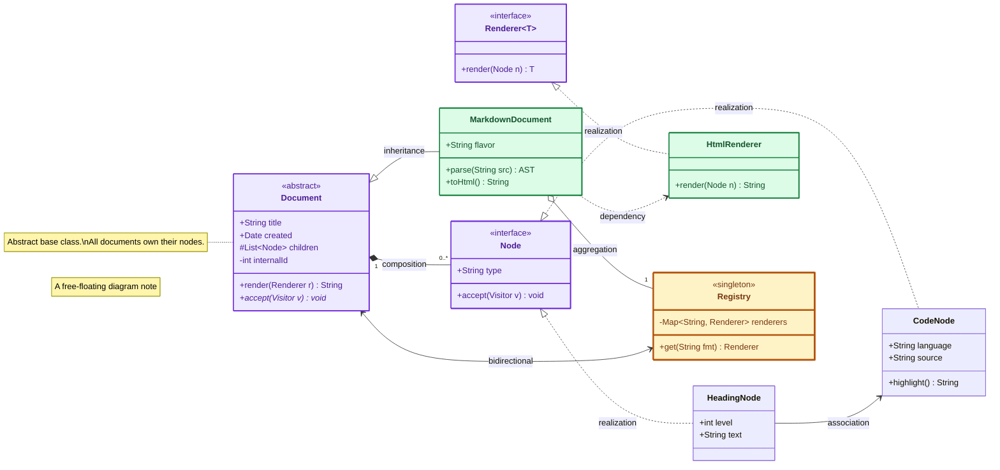

### State diagram — composite states, forks, choices, concurrency, color

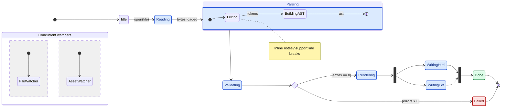

### Entity-relationship diagram — attributes, keys, cardinality

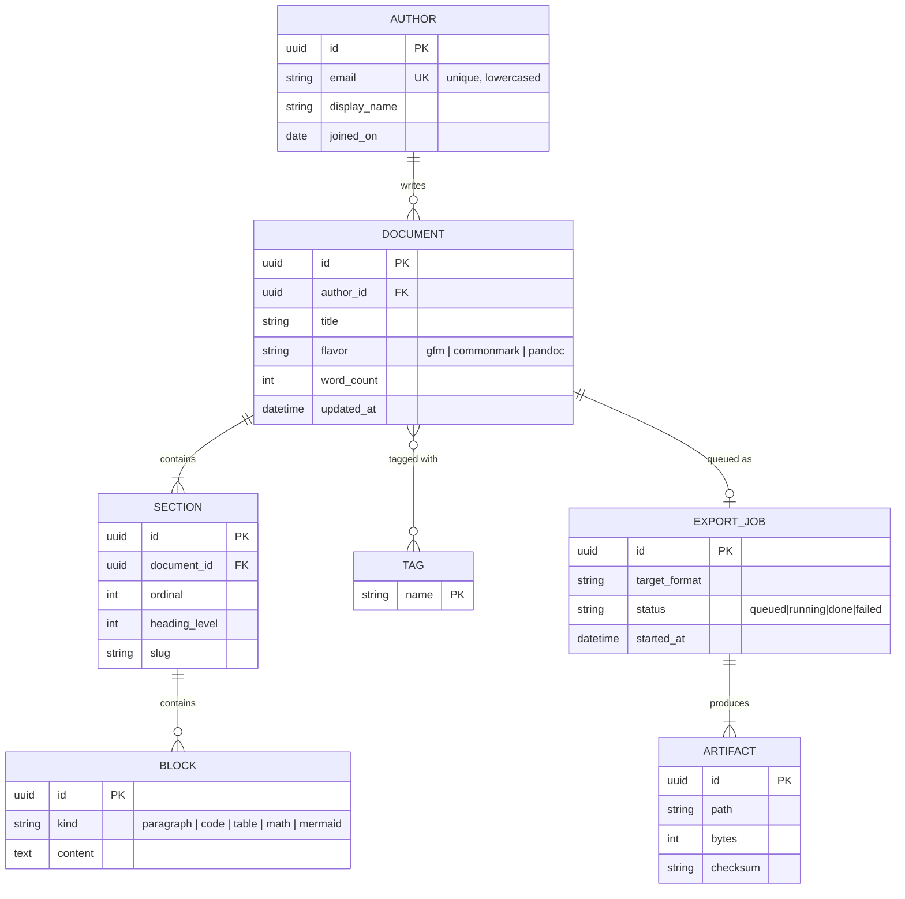

### User journey

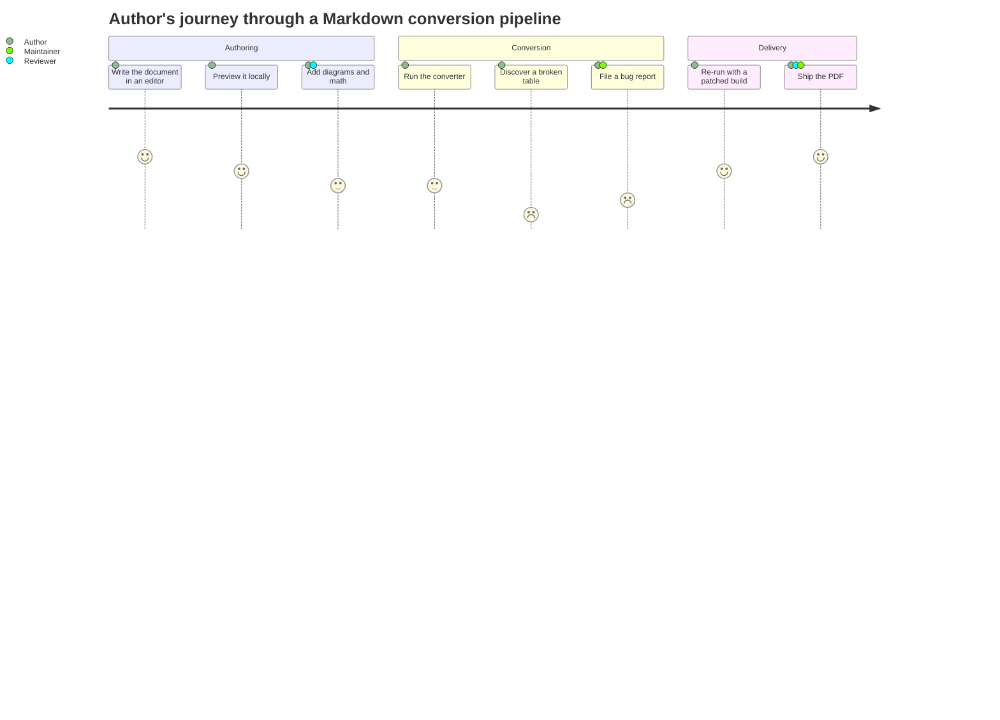

### Gantt chart — sections, dependencies, milestones, critical path

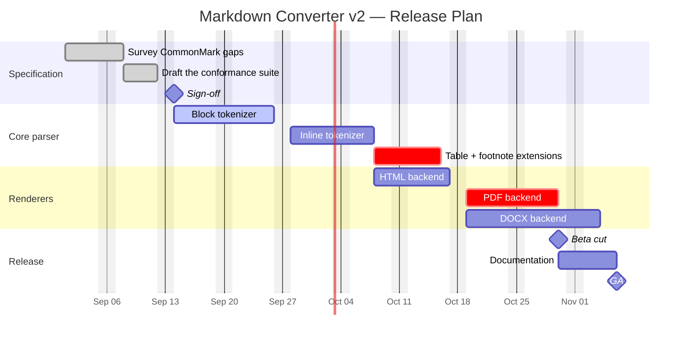

### Pie chart

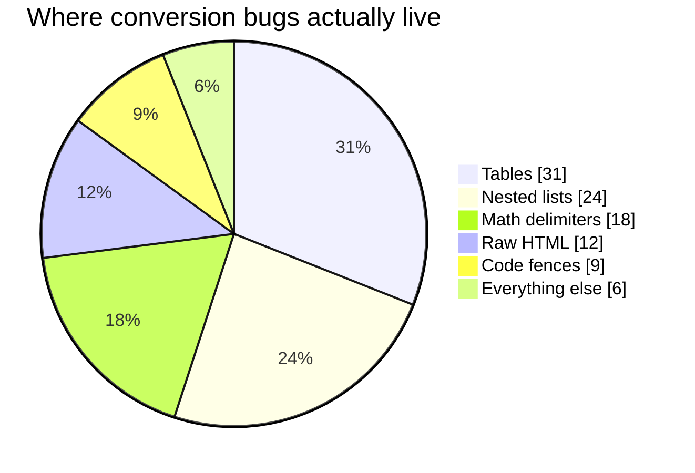

### Quadrant chart

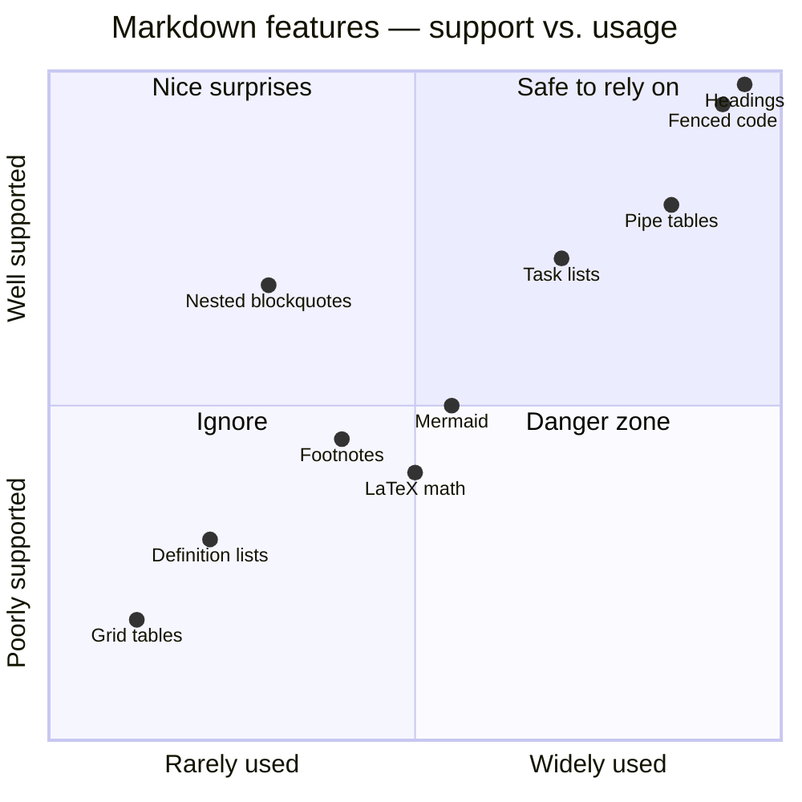

### Requirement diagram

```mermaid
requirementDiagram
    requirement conformance {
        id: REQ-1
        text: The converter shall implement CommonMark 0.31.2.
        risk: high
        verifymethod: test
    }

    functionalRequirement tables {
        id: REQ-1.1
        text: GFM pipe tables shall round-trip without data loss.
        risk: medium
        verifymethod: test
    }

    performanceRequirement speed {
        id: REQ-2
        text: A 1 MB document shall convert in under 2 seconds.
        risk: low
        verifymethod: demonstration
    }

    designConstraint noNetwork {
        id: REQ-3
        text: Conversion shall not require network access.
        risk: medium
        verifymethod: inspection
    }

    element parser {
        type: "module"
        docref: src/parser
    }

    element suite {
        type: "test suite"
        docref: tests/conformance
    }

    conformance - contains -> tables
    parser - satisfies -> conformance
    suite - verifies -> tables
    speed - derives -> conformance
    noNetwork - refines -> conformance
```

### Git graph

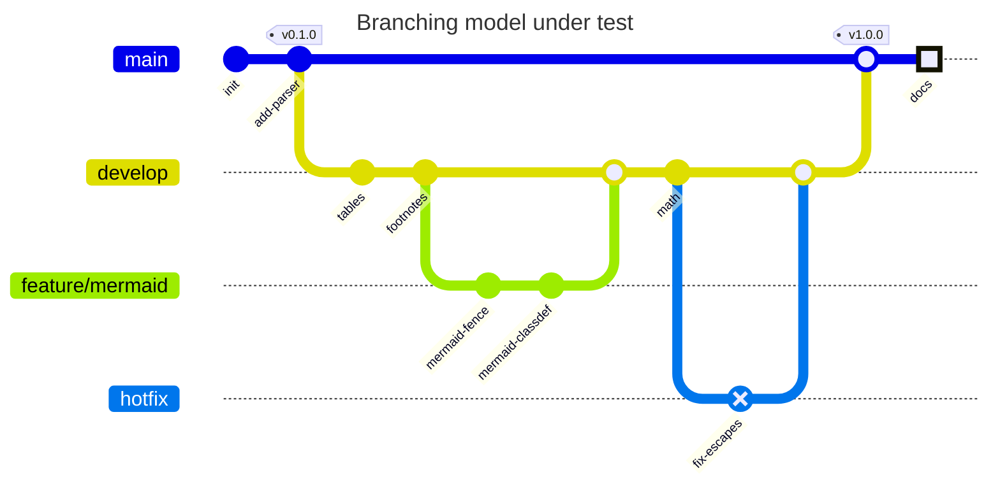

### C4 context diagram

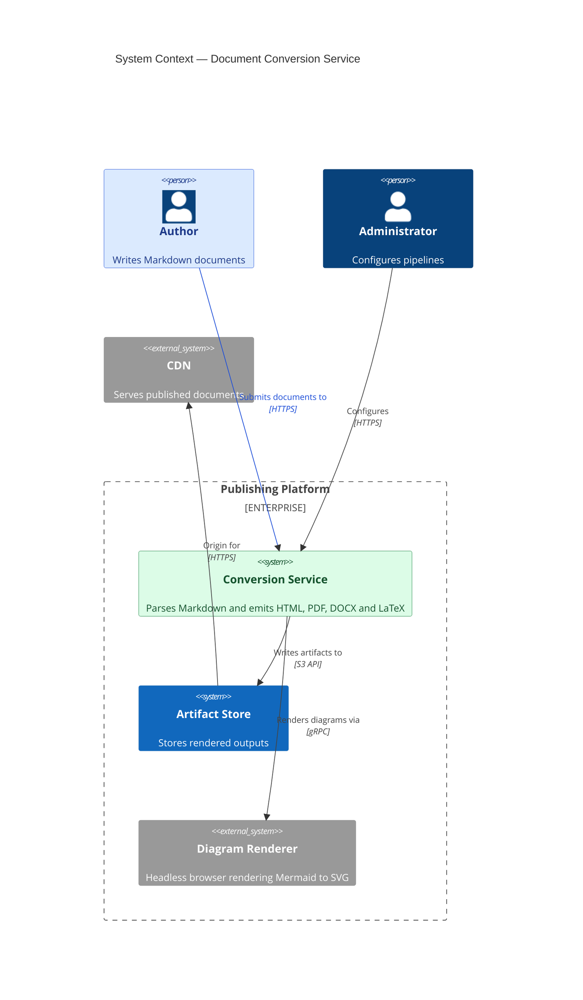

### Mindmap

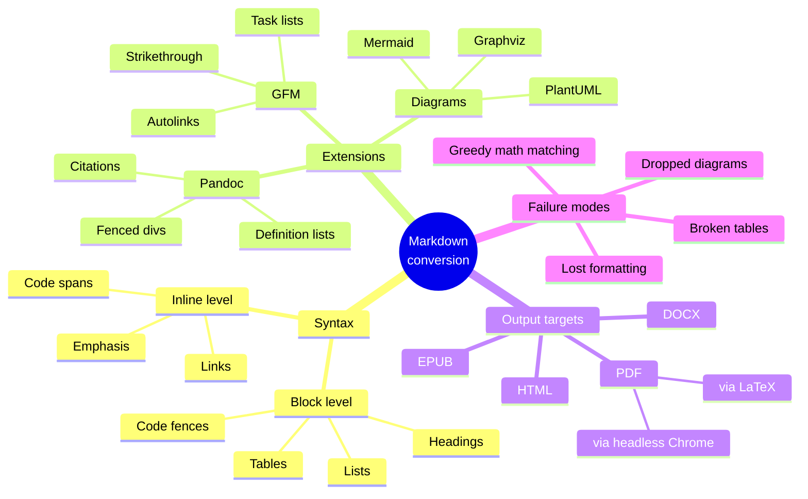

### Timeline

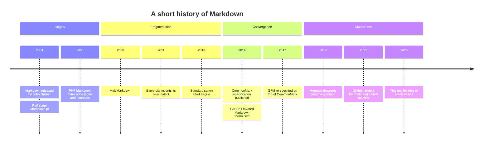

### Sankey diagram

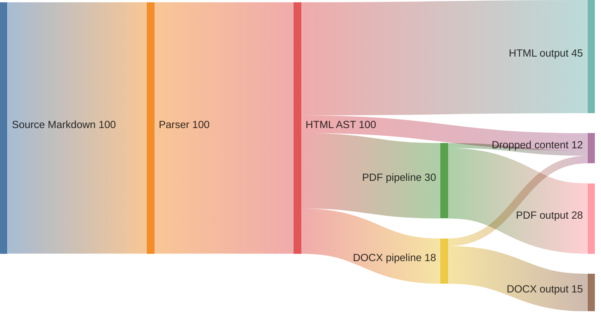

### XY chart

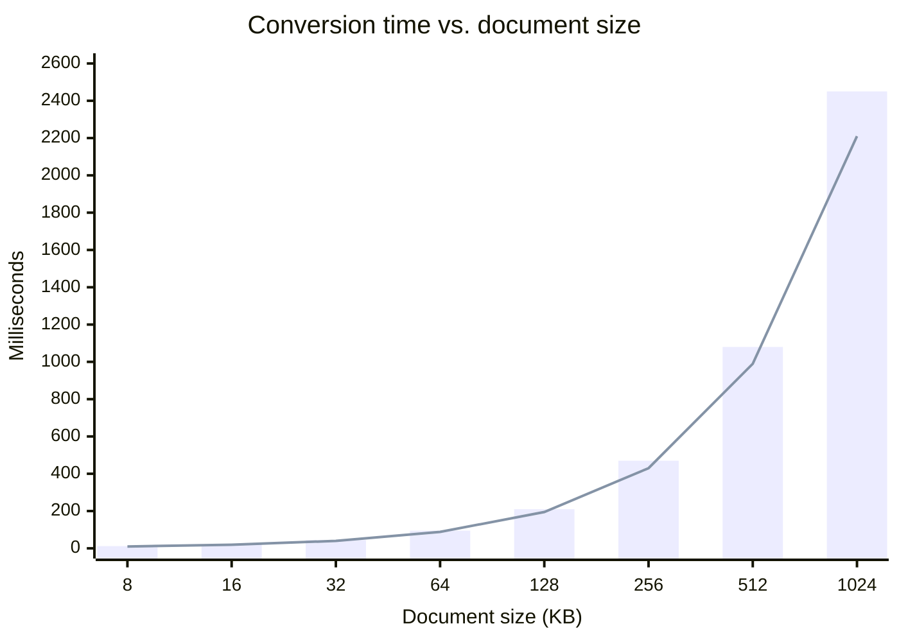

### Block diagram

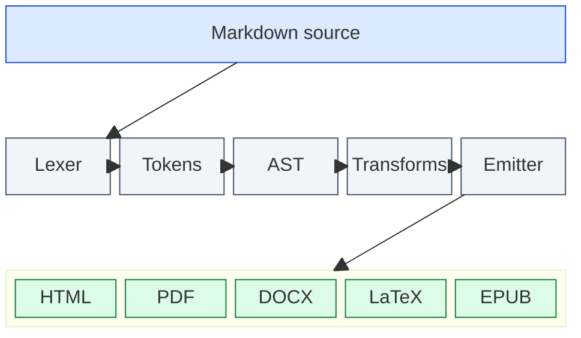

### Packet diagram (binary layout)

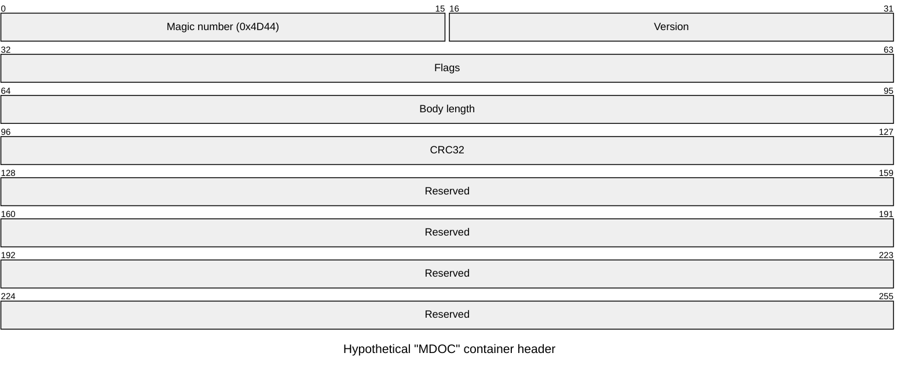

### Kanban board

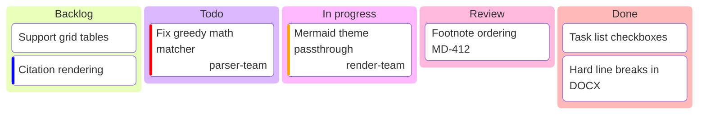

### Architecture diagram

```mermaid
architecture-beta
    group api(cloud)[Conversion Platform]
    group workers(cloud)[Render Workers] in api

    service gateway(internet)[API Gateway] in api
    service queue(database)[Job Queue] in api
    service store(disk)[Artifact Store] in api

    service md(server)[Markdown Worker] in workers
    service chrome(server)[Headless Chrome] in workers
    service tex(server)[LaTeX Worker] in workers

    gateway:R --> L:queue
    queue:R --> L:md
    md:T --> B:chrome
    md:B --> T:tex
    md:R --> L:store
```

### Radar chart

```mermaid
radar-beta
    title Converter feature coverage
    axis syntax["Core syntax"], tables["Tables"], math["Math"]
    axis diagrams["Diagrams"], html["Raw HTML"], meta["Metadata"]
    curve pandoc["Pandoc"]{95, 90, 92, 35, 88, 96}
    curve github["GitHub"]{92, 88, 70, 90, 45, 20}
    curve basic["Basic markdown-it"]{90, 80, 10, 5, 85, 10}
    max 100
    min 0
```

### Treemap

```mermaid
treemap-beta
"Document bytes by block type"
    "Prose"
        "Paragraphs": 4200
        "Headings": 620
        "Lists": 1800
    "Code"
        "Fenced blocks": 3100
        "Inline spans": 450
    "Diagrams"
        "Mermaid": 5200
    "Math"
        "Display": 1400
        "Inline": 380
```

### Mermaid support notes and edge cases

> **HAZARD — bleeding-edge diagram types.** Sections 14.17–14.23 use `-beta`
> grammars (`xychart`, `block`, `packet`, `kanban`, `architecture`, `radar`,
> `treemap`). They require **Mermaid v10.9+ to v11.9+** depending on the type.
> An older renderer shows a red parse-error box for these while rendering
> everything above them correctly — that is an expected, informative failure,
> not a bug in this file.

A mermaid block inside a **collapsible section**:

<details>
<summary>Expand to see a diagram nested inside HTML</summary>

```mermaid
flowchart LR
    A[Fence inside details] --> B{Did it render?}
    B -->|Yes| C[Excellent]
    B -->|No| D[HTML block ate the fence]
    classDef good fill:#dcfce7,stroke:#15803d,color:#14532d
    classDef bad fill:#fee2e2,stroke:#b91c1c,color:#7f1d1d
    class C good
    class D bad
```

</details>

A mermaid block inside a **list item** (indentation-sensitive):

1. First, the fence must stay attached to this list item.

   ```mermaid
   flowchart TD
       X[Indented fence] --> Y[Still inside the list]
       classDef ok fill:#dbeafe,stroke:#1d4ed8,color:#1e3a8a
       class X,Y ok
   ```

2. And this second item proves the list survived.

A mermaid block inside a **blockquote**:

> ```mermaid
> flowchart LR
>     Q[Quoted fence] --> R[Rendered?]
>     classDef q fill:#ede9fe,stroke:#6d28d9,color:#4c1d95
>     class Q,R q
> ```

A deliberately **invalid** diagram — a good renderer shows a parse-error box and
keeps rendering the rest of the document:

```mermaid
flowchart TD
    A[Unclosed bracket --> B{{{ nonsense
    ???
```

> **PASS IF** the document continues normally after the broken diagram above.
> **FAIL IF** the whole page stops rendering here.

---

## Deeply Nested & Adversarial Combinations

> **What is under test.** Real documents combine constructs. This section nests
> them until something snaps.

### The matryoshka block

1. **Ordered item** containing everything below.

   > A blockquote inside the list item.
   >
   > 1. An ordered list inside the blockquote inside the list item.
   >
   >    - [ ] An unstarted task inside that.
   >    - [x] A finished task with `code`, **bold**, and math $\alpha_i$.
   >
   > 2. Second inner item, followed by a table:
   >
   >    | Depth | Construct | Survived? |
   >    |------:|:----------|:---------:|
   >    | 1 | list | ? |
   >    | 2 | quote | ? |
   >    | 3 | list | ? |
   >    | 4 | table | ? |
   >
   > ```python
   > # A fenced block at quote-inside-list depth
   > assert depth == 3, "still nested"
   > ```
   >
   > $$ \sum_{d=1}^{4} \text{depth}_d = 10 $$

   Back at list-item level, after the blockquote closed.

   <details>
   <summary>An HTML disclosure nested in a list item</summary>

   With a nested list inside the HTML inside the list item:

   - alpha
   - beta

   </details>

2. **Second top-level item.** If you can read this as item 2 of an ordered
   list, the nesting survived.

### Constructs that look like other constructs

| Source text                             | Must render as                        |
| --------------------------------------- | ------------------------------------- |
| `1986. A great year.`                   | a paragraph, **not** an ordered list  |
| `- - -` on its own line                 | a horizontal rule, **not** a list     |
| `> not a quote` inside a code span      | literal text                          |
| `#hashtag` at line start                | a paragraph (no space after `#`)      |
| `|not|a|table|` without a delimiter row | a paragraph with pipes                |
| `[not a link]` with no target           | literal bracketed text                |
| `<notatag>`                             | literal text or a dropped unknown tag |
| `http://example.com` in a code span     | plain text, **not** a link            |

1986. A great year for parsers.

# hashtag-at-line-start-is-not-a-heading

|not|a|table|

[not a link]

<notatag>content in a fictional tag</notatag>

`http://example.com` and `> not a quote` and `| not | a | table |`

### Very long unbroken content (wrapping / overflow test)

A very long single-line paragraph with no early wrap opportunity, which should be re-flowed by the renderer rather than overflowing the page: the quick brown fox jumps over the lazy dog while the five boxing wizards jump quickly and pack my box with five dozen liquor jugs, repeatedly, until the line is comfortably wider than any sensible column.

A single unbreakable token, which will either wrap mid-word, overflow, or scroll:

`Pneumonoultramicroscopicsilicovolcanoconiosis_Antidisestablishmentarianism_Floccinaucinihilipilification_Supercalifragilisticexpialidocious`

A long URL that must not break the layout:
<https://example.com/a/very/deep/path/that/keeps/going/and/going?param=value&another=value&third=value&fourth=value#a-long-fragment-identifier-too>

A wide code block that should scroll horizontally rather than wrap:

```text
| id | timestamp            | level | logger                          | message                                                                                 |
|----|----------------------|-------|---------------------------------|-----------------------------------------------------------------------------------------|
| 1  | 2026-09-12T08:14:22Z | WARN  | converter.pipeline.tables       | ragged row detected in table at line 418; padded 2 missing cells to preserve column count |
```

### Whitespace and invisible-character hazards

- A line with trailing spaces but no following line:  
- A line containing a literal tab between words:	tab was here.
- A line containing a non-breaking space: nbsp&nbsp;joined.
- A line with a zero-width space between letters: a​b (looks like "ab").
- A line with a soft hyphen: super&shy;calif&shy;ragilistic.
- Consecutive     internal     spaces     collapse     in     HTML.

### Document-structure directives

Some converters honour these; all others should ignore them silently.

<!-- pagebreak -->

\pagebreak

<div style="page-break-after: always;"></div>

[TOC]

{{ TOC }}

<!-- toc -->
<!-- tocstop -->



![[embedded-note]]

> **PASS IF** none of the above renders as broken markup. Silent omission or
> literal display are both acceptable; corrupted surrounding content is not.

### Citations and cross-references (Pandoc/Quarto)

According to the specification [@commonmark2024, pp. 12-15], inline parsing is
defined in terms of delimiter runs; see also [@gruber2004; @macfarlane2017].
An in-text citation reads @commonmark2024 said so.

Cross-references: see @fig-example, @tbl-results, and @eq-loss.

> **Expected.** Without a bibliography these will stay as literal `@keys`, which
> is fine. They must not be eaten or turned into email addresses.

### Mixed-direction text (bidi)

An English sentence containing Arabic ‏مرحبا بالعالم‎ in the middle, then more
English. And a Hebrew sentence with English inside: ‏זהו טקסט עם המילה Markdown בתוכו‎.

> **HAZARD.** Bidi text plus punctuation is where PDF engines most often reorder
> characters incorrectly. Compare the rendered order against the source.

---

## Appendix A — Conversion Scorecard

> Copy this table into your bug report and fill in the Result column with
> **PASS**, **PARTIAL**, or **FAIL**.

|   # | Feature area                              | Section     | Critical? | Result |
| --: | ----------------------------------------- | ----------- | :-------: | ------ |
|   0 | YAML front matter consumed/hidden         | top of file |    Yes    |        |
|   1 | HTML comments hidden                      | top of file |    Yes    |        |
|   2 | Heading levels H1–H6                      | §1          |    Yes    |        |
|   3 | Setext headings                           | §1          |    No     |        |
|   4 | Seven-hash line stays literal             | §1          |    No     |        |
|   5 | Hard line breaks (2 spaces / backslash)   | §2          |    Yes    |        |
|   6 | Bold / italic / nesting                   | §3          |    Yes    |        |
|   7 | Strikethrough                             | §3          |    Yes    |        |
|   8 | Highlight, sub, sup, small caps           | §3          |    No     |        |
|   9 | `snake_case` not italicized               | §3          |    Yes    |        |
|  10 | Backslash escapes                         | §4          |    Yes    |        |
|  11 | HTML entities                             | §4          |    Yes    |        |
|  12 | CJK / RTL / combining marks               | §4          |    Yes    |        |
|  13 | Emoji incl. ZWJ sequences                 | §4          |    No     |        |
|  14 | Blockquotes incl. nesting                 | §5          |    Yes    |        |
|  15 | GFM alerts (`[!NOTE]` …)                  | §5          |    No     |        |
|  16 | Fenced-div / `!!!` callouts               | §5          |    No     |        |
|  17 | Ordered / unordered / start offsets       | §6          |    Yes    |        |
|  18 | Five-level nesting                        | §6          |    Yes    |        |
|  19 | Tight vs. loose spacing                   | §6          |    No     |        |
|  20 | Multi-block list items                    | §6          |    Yes    |        |
|  21 | Task list checkboxes                      | §6          |    No     |        |
|  22 | Lazy continuation                         | §6          |    No     |        |
|  23 | Inline code with backticks                | §7          |    Yes    |        |
|  24 | Fenced code + language highlighting       | §7          |    Yes    |        |
|  25 | Tilde fences                              | §7          |    No     |        |
|  26 | Indented code blocks                      | §7          |    Yes    |        |
|  27 | Nested (4-backtick) fences                | §7          |    Yes    |        |
|  28 | Fence attributes / line numbers           | §7          |    No     |        |
|  29 | Inline / reference / autolinks            | §8          |    Yes    |        |
|  30 | Links with parens and queries             | §8          |    Yes    |        |
|  31 | Wiki-links                                | §8          |    No     |        |
|  32 | Images incl. data URIs and SVG            | §8          |    Yes    |        |
|  33 | Broken-image alt-text fallback            | §8          |    Yes    |        |
|  34 | Figure captions                           | §8          |    No     |        |
|  35 | Footnotes (all dialects)                  | §8          |    No     |        |
|  36 | GFM tables + alignment                    | §9          |    Yes    |        |
|  37 | Formatting inside table cells             | §9          |    Yes    |        |
|  38 | Ragged rows tolerated                     | §9          |    Yes    |        |
|  39 | Grid tables / captions                    | §9          |    No     |        |
|  40 | HTML tables with colspan/rowspan          | §9          |    No     |        |
|  41 | Horizontal rules, all markers             | §10         |    Yes    |        |
|  42 | Raw HTML block passthrough                | §11         |    No     |        |
|  43 | `<details>` with markdown inside          | §11         |    No     |        |
|  44 | Script/style/iframe sanitized             | §11         |    Yes    |        |
|  45 | Definition lists                          | §12         |    No     |        |
|  46 | Abbreviations                             | §12         |    No     |        |
|  47 | Fenced divs / bracketed spans             | §12         |    No     |        |
|  48 | Line blocks                               | §12         |    No     |        |
|  49 | Custom heading ids                        | §12         |    No     |        |
|  50 | Inline math `$…$`                         | §13         |    Yes    |        |
|  51 | Display math `$$…$$`                      | §13         |    Yes    |        |
|  52 | AMS `align`, `cases`, matrices            | §13         |    Yes    |        |
|  53 | Math with underscores/asterisks intact    | §13         |    Yes    |        |
|  54 | Currency `$` NOT treated as math          | §13         |    Yes    |        |
|  55 | mhchem chemistry                          | §13         |    No     |        |
|  56 | Raw LaTeX / HTML passthrough blocks       | §13         |    No     |        |
|  57 | Mermaid flowchart + `classDef` color      | §14.1       |    Yes    |        |
|  58 | Mermaid sequence diagram                  | §14.3       |    Yes    |        |
|  59 | Mermaid class diagram                     | §14.4       |    No     |        |
|  60 | Mermaid state diagram                     | §14.5       |    No     |        |
|  61 | Mermaid ER diagram                        | §14.6       |    No     |        |
|  62 | Mermaid journey / gantt / pie             | §14.7–9     |    No     |        |
|  63 | Mermaid quadrant / requirement / gitGraph | §14.10–12   |    No     |        |
|  64 | Mermaid C4 / mindmap / timeline           | §14.13–15   |    No     |        |
|  65 | Mermaid sankey / xychart                  | §14.16–17   |    No     |        |
|  66 | Mermaid block / packet / kanban           | §14.18–20   |    No     |        |
|  67 | Mermaid architecture / radar / treemap    | §14.21–23   |    No     |        |
|  68 | Mermaid inside details / list / quote     | §14.24      |    Yes    |        |
|  69 | Broken diagram does not kill the page     | §14.24      |    Yes    |        |
|  70 | Four-level nesting survives               | §15.1       |    Yes    |        |
|  71 | Look-alike constructs not misparsed       | §15.2       |    Yes    |        |
|  72 | Long lines / long tokens wrap sanely      | §15.3       |    No     |        |
|  73 | Invisible characters preserved            | §15.4       |    No     |        |
|  74 | Directives ignored harmlessly             | §15.5       |    No     |        |
|  75 | Citations left intact                     | §15.6       |    No     |        |
|  76 | Bidi text ordering correct                | §15.7       |    No     |        |

**Scoring.** Count only the rows marked *Critical = Yes* (43 of them) for a
pass/fail verdict; the rest measure polish.

- **43/43 critical** — production-ready converter.
- **38–42 critical** — usable with documented caveats.
- **Below 38 critical** — expect visible corruption in real documents.

---

## Appendix B — Quick Reference of Flavor Ownership

| Construct                     | CommonMark | GFM | Pandoc | Obsidian/Quarto |
| ----------------------------- | :--------: | :-: | :----: | :-------------: |
| Headings, lists, code, quotes |     ✅      |  ✅  |   ✅    |        ✅        |
| Tables                        |     ❌      |  ✅  |   ✅    |        ✅        |
| Strikethrough `~~x~~`         |     ❌      |  ✅  |   ✅    |        ✅        |
| Task lists                    |     ❌      |  ✅  |   ✅    |        ✅        |
| Autolink bare URLs            |     ❌      |  ✅  |   ✅    |        ✅        |
| Footnotes                     |     ❌      |  ✅  |   ✅    |        ✅        |
| Alerts `[!NOTE]`              |     ❌      |  ✅  |   ❌    |        ✅        |
| Definition lists              |     ❌      |  ❌  |   ✅    |        ✅        |
| Abbreviations                 |     ❌      |  ❌  |   ✅    |        ❌        |
| Superscript / subscript       |     ❌      |  ❌  |   ✅    |        ✅        |
| Highlight `==x==`             |     ❌      |  ❌  |   ❌    |        ✅        |
| Fenced divs `:::`             |     ❌      |  ❌  |   ✅    |        ✅        |
| Line blocks                   |     ❌      |  ❌  |   ✅    |        ❌        |
| Grid tables                   |     ❌      |  ❌  |   ✅    |        ❌        |
| Citations `@key`              |     ❌      |  ❌  |   ✅    |        ✅        |
| YAML front matter             |     ❌      |  ~  |   ✅    |        ✅        |
| LaTeX math                    |     ❌      |  ✅  |   ✅    |        ✅        |
| Mermaid                       |     ❌      |  ✅  |   ~    |        ✅        |
| Wiki-links `[[x]]`            |     ❌      |  ❌  |   ❌    |        ✅        |
| Raw HTML                      |     ✅      |  ~  |   ✅    |        ✅        |

✅ supported ~ partial/plugin ❌ not supported

---

## Appendix C — Minimal Repro Snippets

If a section fails, paste the smallest reproducer below into a bug report.

Hard break:

```markdown
line one  
line two
```

Nested fence:

````markdown
```text
inner
```
````

Currency false positive:

```markdown
It costs $5.00 and also $6.00.
```

Table with escaped pipe:

```markdown
| a | b |
|---|---|
| x \| y | z |
```

Mermaid with color:

````markdown
```mermaid
flowchart LR
    A[Start] --> B[End]
    classDef c fill:#dcfce7,stroke:#15803d,color:#14532d
    class A,B c
```
````

Math with underscores:

```markdown
$T_{\text{max}} = \max_i x_i \cdot w_{i,\text{norm}}$
```

---

<div align="center">

**End of the Ultimate Markdown Conversion Test**

* If you can read this centered, bold, italic line with the surrounding rules
intact, the document survived to the last byte.*

</div>

---
