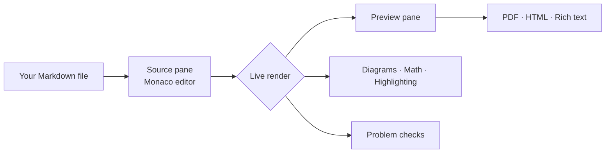
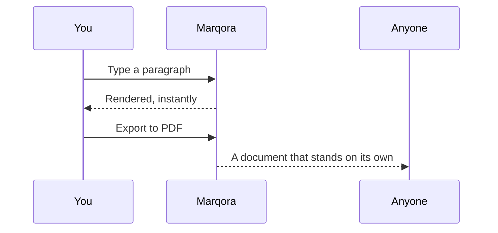

# Welcome to Marqora

**A modern Markdown workspace for Windows 11 — a real editor, a live preview, and
everything in between.**

Marqora pairs a full code editor with a rendered preview that keeps pace as you type.
Diagrams draw themselves, equations typeset themselves, links check themselves, and the whole
thing runs on your machine: no account, no sign-in, no network call, no telemetry.

> Write in Markdown. See the finished page. Send it anywhere.

---

## Try it right now

- [x] Open this document — done
- [ ] Press `Alt+2` for the split view, then `Alt+3` to come back to the preview
- [ ] Press `Ctrl+F1` for the Markdown cheatsheet, and leave it beside the editor
- [ ] Double-click the diagram further down this page
- [ ] Press `Ctrl+Shift+F` and search every open document at once

Nothing here is a demo mode. It is the app, and this is an ordinary Markdown file.

---

## The workspace



Source on the left, the finished page on the right, and a render between them fast enough
that the preview is simply what your document looks like. The panes scroll together — mapped
through source line numbers rather than scroll percentage, so a tall diagram never throws the
alignment off.

| View | Shortcut | For |
|------|----------|-----|
| Source only | `Alt+1` | Writing at speed |
| Split | `Alt+2` | Writing and watching |
| Preview only | `Alt+3` | Reading and reviewing |

---

## What makes it worth your time

**A real editor, not a text box.** The source pane is Monaco — the editor from Visual Studio
Code — with find and replace, multiple cursors, undo that goes as far back as you need, and
syntax highlighting inside fenced code blocks.

**Documents in tabs.** Every tab keeps its own undo history, cursor and scroll position, so
switching costs nothing and loses nothing. `Ctrl+1`–`Ctrl+8` jump straight to a tab,
`Ctrl+Tab` walks along them, and dragging reorders them.

**Your session comes back.** Close Marqora with a dozen documents open and they are all there
next time, with the same tab in front.

**Markdown without the punctuation.** The Format menu and the toolbar beneath it apply bold,
italic, links, lists, quotes, headings, tables and code blocks — and everything toggles, so
the button that switched something on switches it off again. The bar is live: it lights up
for whatever the cursor is inside, and the heading control reads `H2` when you are in one.

**One tidy-up command.** `Shift+Alt+F` formats the document against sixteen rules you choose
from — spacing, list markers, ordered numbering, table alignment, line endings and the rest.
Three promises hold whatever you switch on: it never changes what the document renders to, it
never touches the inside of a code block or your front matter, and `Ctrl+Z` takes the whole
reformat back in one step.

**Problems, underlined.** A dead link renders exactly like a live one, so Marqora checks them
for you — missing files, missing images, and anchors that point at no heading — along with the
small style slips the formatter would fix.

**Find All.** `Ctrl+Shift+F` answers "where does this appear?" in one window: every match at
once, across every open document, grouped by the file it came from. Select a row and the
source pane switches tabs, scrolls to the line and selects the text.

---

## Diagrams, math and code

Fenced ` ```mermaid ` blocks become diagrams in the preview. **Double-click one** and it opens
in a window of its own that you can resize, park on a second monitor, and leave open while you
keep editing — it redraws as the diagram changes.



Math is typeset with KaTeX, inline as $a^2 + b^2 = c^2$ or as a display block:

$$
\sigma = \sqrt{\frac{1}{N}\sum_{i=1}^{N}(x_i - \mu)^2}
$$

Code is highlighted in both panes, in whichever language you name on the fence:

```csharp
public static string Greet(string name) => $"Hello, {name}.";
```

The rest of it is here too — tables, footnotes, task lists, definition lists, YAML front
matter, auto-links, emoji :rocket:, ==highlighting==, super^script^ and sub~script~.[^1]

[^1]: All of it rendered locally. Marqora never sends your document anywhere.

---

## Taking it elsewhere

| Export | What you get |
|--------|--------------|
| `Ctrl+Shift+C` — Copy as Rich Text | The formatted page on the clipboard, ready for Word, Outlook or Confluence |
| `Tools > Export to PDF...` | A printed copy, with paper size, orientation and margins of your choosing |
| `Tools > Export to HTML...` | One self-contained `.html` file — styles inlined, images embedded, fonts included |

Exports come from the preview you are looking at rather than from a fresh render, so diagrams
are already drawn, math is already typeset and code is already colored. What you see is what
leaves the building.

---

## Yours, and only yours

Marqora is local software. It opens files from your disk, renders them in its own process, and
writes them back where you put them. There is nothing to sign in to and nothing to opt out of.

| Where | What |
|-------|------|
| `%LOCALAPPDATA%\PaulTechGuy\Marqora\settings.json` | Preferences and window placement |
| `%LOCALAPPDATA%\PaulTechGuy\Marqora\recent-files.json` | Recent and pinned files |
| `%LOCALAPPDATA%\PaulTechGuy\Marqora\snippets\` | Your own snippets, one per file |
| `%LOCALAPPDATA%\PaulTechGuy\Marqora\logs\` | Rolling logs, kept 14 days |

Deleting any of it is safe. Marqora writes it again.

---

## Worth knowing

- **One window.** Opening a document while Marqora is running adds a tab to the window you
  already have, rather than starting a second copy.
- **`Ctrl+Shift+O` opens a whole folder**, one tab per Markdown file — and deliberately not its
  subfolders, so pointing it at a repository does not produce hundreds of tabs.
- **Files are watched.** If a document changes on disk and you have no unsaved edits in it, the
  tab quietly catches up. If you do have edits, Marqora asks first.
- **Snippets are just files.** Drop a `.md` file into your snippets folder and it appears on the
  toolbar's **Insert** menu, under *Your snippets*.
- **Everything is on the keyboard.** `Alt` puts you on the menu bar, and `Help > Keyboard
  Shortcuts...` lists every shortcut in the app with a button that copies the lot.

---

## The shortcuts worth memorizing

| Command | Keys | Command | Keys |
|---------|------|---------|------|
| Open | `Ctrl+O` | Bold / italic | `Ctrl+B` / `Ctrl+I` |
| Open folder | `Ctrl+Shift+O` | Link | `Ctrl+K` |
| Save / Save all | `Ctrl+S` / `Ctrl+Shift+S` | Format document | `Shift+Alt+F` |
| New tab / close tab | `Ctrl+N` / `Ctrl+W` | Find All | `Ctrl+Shift+F` |
| Source / split / preview | `Alt+1` `Alt+2` `Alt+3` | Cheatsheet | `Ctrl+F1` |
| Zoom the active pane | `Ctrl` `+` `-` `0` | Word wrap | `Alt+Z` |

---

## About this document

This page opens by itself the first time you run a new release of Marqora, so you always know
what the version in front of you can do. It is a copy kept in your own data folder, which means
you can scribble on it, save it, or close it and never think about it again — the next release
brings a fresh one.

**Want it back?** Hold `Shift` while starting Marqora. It opens again, replaced with the copy
that shipped, however long ago this version introduced itself.

`Help > About Marqora` shows the version you are running, along with where everything lives and
a **Copy details** button for when something needs reporting.

**Now open something of your own.** `Ctrl+O`, or drag a file onto the window.
