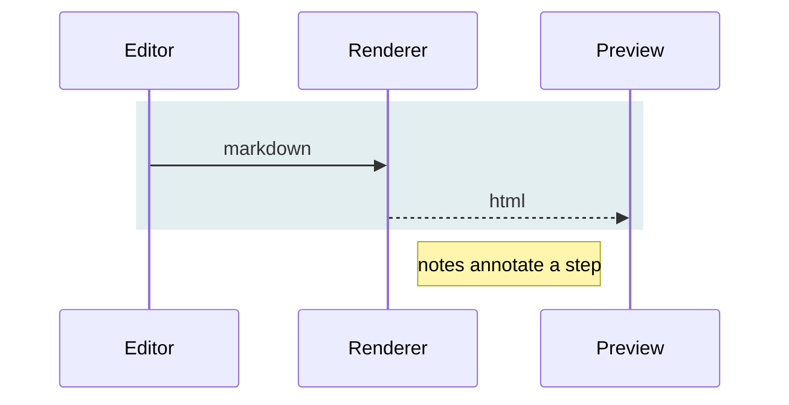

# Markdown Cheatsheet

Everything Marqora renders, with the syntax beside the result.

Jump to: [Text](#text) · [Headings](#headings) · [Lists](#lists) · [Links](#links-and-images) ·
[Code](#code) · [Quotes](#quotes-and-rules) · [Callouts](#callouts) · [Tables](#tables) ·
[Notes](#footnotes-and-definitions) ·
[Diagrams](#diagrams) · [Math](#math) · [Front matter](#front-matter) · [Escaping](#escaping)

## Text

| Type this | To get this |
|---|---|
| `*italic*` or `_italic_` | *italic* |
| `**bold**` or `__bold__` | **bold** |
| `***bold italic***` | ***bold italic*** |
| `~~strike through~~` | ~~strikc through~~ |
| `==highlighted==` | ==highlighted== |
| `` `inline code` `` | `inline code` |
| `H~2~O` | H~2~O |
| `E = mc^2^` | E = mc^2^ |
| `$x = \frac{-b \pm \sqrt{b^2 - 4ac}}{2a}$` | $x = \frac{-b \pm \sqrt{b^2 - 4ac}}{2a}$ |
| `++inserted++` | ++inserted++ |
| `:rocket:` `:+1:` | :rocket: :+1: |

Two spaces at the end of a line, or a backslash, force a line break without starting a new
paragraph. A blank line starts a new paragraph.

## Headings

````text
# Heading 1
## Heading 2
### Heading 3
#### Heading 4
##### Heading 5
###### Heading 6
````

Every heading gets a GitHub-style anchor, so `## Open Folder` can be linked as
`[jump](#open-folder)`. An underlined form also works for the first two levels:

````text
Heading 1
=========

Heading 2
---------
````

## Lists

| Type this | To get this |
|---|---|
| `- item` / `* item` / `+ item` | an unordered list |
| `1. item` | an ordered list |
| `1) item` | an ordered list with parentheses |
| `- [ ] to do` | an unchecked task |
| `- [x] done` | a checked task |

Indent by two spaces to nest. A list stays "tight" until a blank line appears between items,
at which point every item is wrapped in a paragraph and gains extra spacing.

````text
- Fruit
  - Apple
  - Pear
- Vegetables
  1. Carrot
  2. Leek

- [x] Ship the exporter
- [ ] Write the cheatsheet
````

- Fruit
  - Apple
  - Pear
- Vegetables
  1. Carrot
  2. Leek

- [x] Ship the exporter
- [ ] Write the cheatsheet

Start an ordered list at any number; the rest follow on automatically.

````text
5. Five
1. Six
1. Seven
````

5. Five
1. Six
1. Seven

## Links and images

| Type this | To get this |
|---|---|
| `[Marqora](https://example.com)` | [Marqora](https://example.com) |
| `[with a title](https://example.com "Tooltip")` | [with a title](https://example.com "Tooltip") |
| `<https://example.com>` | <https://example.com> |
| `https://example.com` | https://example.com |
| `[jump](#tables)` | [jump](#tables) |
| `[reference][ref]` | [reference][ref] |

[ref]: https://example.com "Defined at the bottom of the file"

Reference definitions can sit anywhere in the document and are not rendered:

````text
[reference][ref]

[ref]: https://example.com "Optional title"
````

Images are links with a leading `!`. A relative path resolves against the folder the document
was opened from, so `` works the way it does in any other viewer.

````text


[](https://example.com)
````

## Code

Inline code goes between backticks. To show a backtick, use more of them on the outside:
`` `like this` ``.

Fenced blocks use three backticks. Naming the language turns on syntax highlighting:

`````text
```csharp
public sealed record Document(string Path, bool IsDirty);
```
`````

```csharp
public sealed record Document(string Path, bool IsDirty);
```

Leave the language off for plain text, and use four backticks when the block itself has to
contain a three-backtick fence. Indenting four spaces also makes a code block, but a fence is
clearer and can carry a language.

## Quotes and rules

````text
> A blockquote.
>
> > Nested one level deeper.
>
> — Attribution

---
````

> A blockquote.
>
> > Nested one level deeper.
>
> — Attribution

---

Three or more `-`, `*` or `_` on their own line draw a horizontal rule.

## Callouts

A blockquote whose first line is `[!NOTE]` becomes a callout. Five kinds, each with its own
color and icon, and the body takes any markdown you like.

````text
> [!TIP]
> Callouts hold **bold**, `code`, links and lists like anything else.
````

> [!NOTE]
> Useful to know.

> [!TIP]
> A better way to go about it.

> [!IMPORTANT]
> Worth stopping for.

> [!WARNING]
> This one can bite.

> [!CAUTION]
> This one can hurt.

The color comes from the app rather than from the document, so callouts follow the theme and
land the right way round in an export.

## Tables

Colons in the divider row set the alignment: left, centre, right.

````text
| Left | Centre | Right |
|:-----|:------:|------:|
| a    |   b    |     c |
| long text | 2 |  3.50 |
````

| Left | Centre | Right |
|:-----|:------:|------:|
| a    |   b    |     c |
| long text | 2 |  3.50 |

The outer pipes are optional and the dividers need not line up — only the colons matter.
Cells accept inline markdown, so `**bold**` and `` `code` `` work inside them.

## Footnotes and definitions

````text
A claim that needs support.[^1]

[^1]: The supporting note, collected at the foot of the document.

Term
:   The definition of that term.
:   A second definition.
````

A claim that needs support.[^1]

[^1]: The supporting note, collected at the foot of the document.

Term
:   The definition of that term.
:   A second definition.

Abbreviations expand on hover wherever the word appears:

````text
*[HTML]: HyperText Markup Language

Exporting to HTML keeps everything in one file.
````

*[HTML]: HyperText Markup Language

Exporting to HTML keeps everything in one file.

## Diagrams

A fence labelled `mermaid` is drawn as a diagram rather than shown as code.

`````text

`````


`classDef` names a set of styles and `class` puts nodes into it. Colors written this way belong
to the document rather than to the app, so they stay exactly as typed when the theme changes —
which is the reason to pick fills that carry white text on a light page and a dark one alike.

Sequence, state, class, pie, Gantt, ER and mindmap diagrams all work the same way:

`````text

`````


A sequence diagram has no `classDef`. `rect` shades a run of messages instead, and giving it a
translucent color lets the page show through, so the one line reads on either theme.

## Math

Wrap an expression in single dollars for inline math, double dollars for a displayed one.

| Type this | To get this |
|---|---|
| `$E = mc^2$` | $E = mc^2$ |
| `$\alpha + \beta$` | $\alpha + \beta$ |
| `$\frac{a}{b}$` | $\frac{a}{b}$ |

````text
$$
\int_{0}^{\infty} e^{-x^2}\,dx = \frac{\sqrt{\pi}}{2}
$$
````

$$
\int_{0}^{\infty} e^{-x^2}\,dx = \frac{\sqrt{\pi}}{2}
$$

## Front matter

A YAML block fenced by `---` at the very top of the file is treated as metadata and is not
rendered.

````text
---
title: Release notes
author: Paul
date: 2026-08-23
tags: [markdown, release]
---

# Release notes
````

## Escaping

Put a backslash in front of a character to stop it being read as markup:
`\*not italic\*` gives \*not italic\*. The characters worth escaping are:

````text
\   `   *   _   {   }   [   ]   (   )   #   +   -   .   !   |   $
````

Raw HTML passes through untouched, which is the escape hatch when markdown runs out:

````text
Text with <kbd>Ctrl</kbd>+<kbd>S</kbd> and a <sup>superscript</sup>.
````

Text with <kbd>Ctrl</kbd>+<kbd>S</kbd> and a <sup>superscript</sup>.

An HTML comment is the usual way to leave a note that no reader will see:

````text
<!-- This never appears in the preview. -->
````
